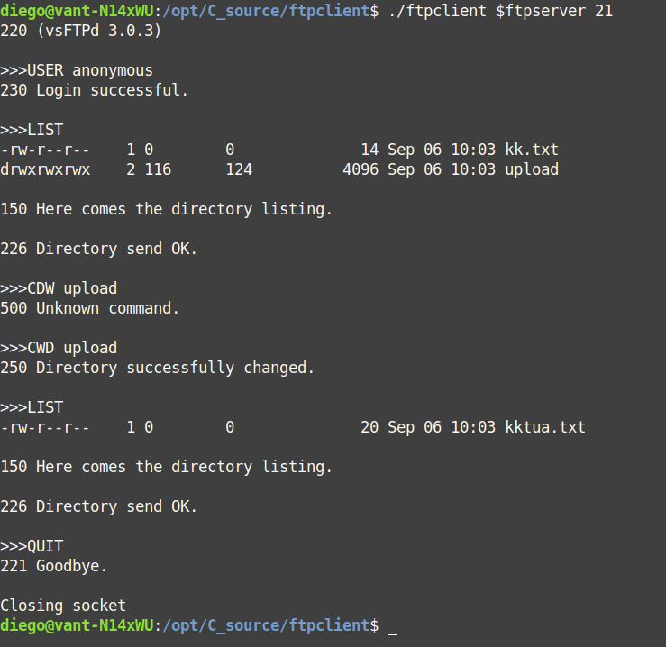

# Simple FTP Client
 
Very simple FTP client with just a few commands.




## Usage 

```
git clone https://github.com/dipaso50/ftpClientFromScratch.git
cd ftpClientFromScratch/
make 
./ftpclient serverip port
```

## Licence

MIT.

 